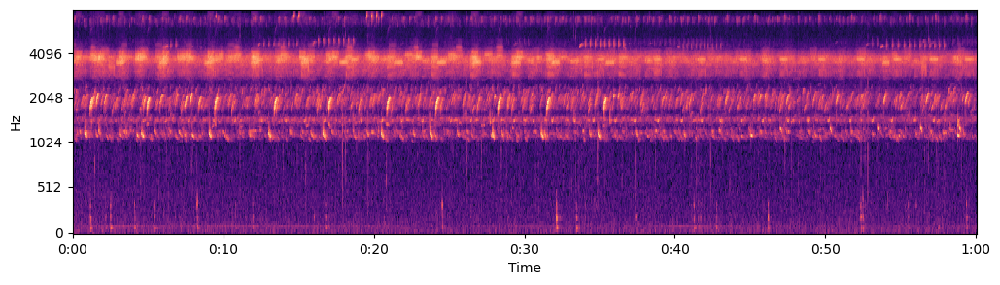
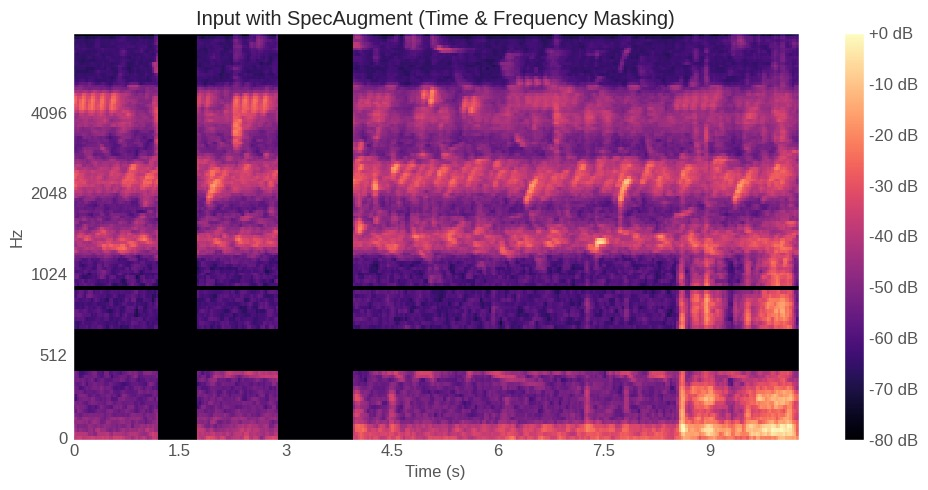
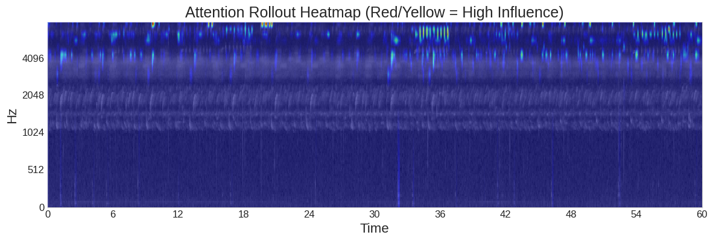

# Bioacoustics: Assessing Ecosystem Biodiversity using Transformers


## [**Live Website: https://bioacoustics.vercel.app**](https://bioacoustics.vercel.app)


*(Real-time inference showing biodiversity scoring, spectrogram generation, plotly distribution & XAI heatmap)*

- - - - - - - - - - - - - - - - - - - - - - - - - - - - - - - - - - - - - - - - - - -

### 🏆 1st Place - AI & Data Science Showcase 
***University of Houston | HPE-Data Science Institute - Fall 2025***

Our team developed an end-to-end ML pipeline for assessing the biodiversity of ecosystems using only the audio signal as input to a custom Audio Spectrogram Transformer (AST).

**Our Team:**
* **Dylan Berens** (Machine Learning Engineer)
* **Dominic McDonald** (Data Science Webmaster)
* **Shruthi Yenamagandla** (CNN Architect)

---

## 🚰 Data Pipeline 
* **Input:** We projected the raw audio waveform (1D) onto a 2D surface as a Mel Audio Spectrogram, representing frequency as the y-axis, time as the x-axis, and amplitude as the coloring of the image.

* **Target Variable:** We created our custom "Robust Acoustic Diversity Index (ADI)", a calculation derived from the Shannon Entropy across 30 frequency bands.
  * **Background Subtraction:** removes constant noise (like rain or rivers) by subtracting the median energy across the spectrogram
  * **Adaptive Thresholding:** only count sounds >13.5dB above baseline
  * **Frequency Banding:** splits the spectrogram into 30 vertically stacked 200Hz frequency bands
  * **Shannon Entropy:** measures the evenness of activity across the 30 bands to reward diverse ecosystems with different frequencies
  * **Soft Fallback:** assigns a fractional score based on energy sum if nothing >13.5 dB, to discourage flat 0 scores
* **Dataset:** [Kaggle RFCx Species Audio Detection](https://www.kaggle.com/competitions/rfcx-species-audio-detection/data)
* **Model:** A pre-trained HuggingFace Audio Spectrogram Transformer (AST) with a 3 layer custom regression head.
  * Sequential Transfer Learning: ViT-base (ImageNet) -> AST  (AudioSet) -> Our Custom Model (Rainforest Bioacoustics)
  * Scale: ~86.6M parameters, 101 layers
* **Libraries:** PyTorch | TensorFlow | HuggingFace | Librosa | NumPy | Pandas | Plotly | Torchaudio | FFmpeg | Matplotlib | OpenCV

---

## ⚙️ Methods & Training
* **Results:** Achieved **R² = 0.95** after 75 epochs, with our baseline CNN scoring 0.70 with the same setup.
* **Differential Learning Rates:**
  * 1e-5 for the backbone to allow for gradual fine tuning of the extensively trained AST backbone
  * 1e-4 for the custom regression head to more rapidly converge
* **Temporal Augmentation (Training):** During training our model sees a random 10.24s slice from the 60s file each epoch. This turns what was a limiting constraint based on model architecture (built to digest 10.24s at a time) into a form of data augmentation that promotes generalization: over 75 epochs, the model sees the entire file, but not the same slice twice, preventing memorization.
* **Loss Function:** Mean Absolute Error (MAE): to not discourage the model for making bold predictions
* **SpecAugment:** We applied Frequency Masking (horizontal black bars masking Hz ranges) and Temporal Masking (vertical black bars masking time ranges), as a second form of data augmentation, to promote generalizability by further encouraging the model to not rely on particular regions too heavily.


## 🔬 Explainable AI (XAI): Attention Rollout Heatmap
We implemented Attention Rollout Heatmaps for model interpretability, to be able to explain *why* our model was predicting the way it did. This visualization marks regions of the Spectrogram it sits on top of, indicating regions of the audio file that most heavily influenced the model's prediction.



*(It's worth noting early versions of this project resulted in attention heatmaps with broad regions colored; the sparse, targeted marks on our current attention rollout heatmaps are indicative of a confident model that knows where to look to assess biodiversity, which aligns with the 0.95 R² of our final AST model.)*

---

## 🚀 Deployment
* **Sliding Window Inference (Production):** Since the AST expects an input of 10.24s, our approach stitches together 6 non-overlapping windows when performing inference to cover the full 60s soundscape
  * *Aggregation Logic:* Our method predicts the ADI score for all 6 slices of spectrogram, **selects the top 3 scores, and averages** them. This was a domain specific choice because an ecosystem is as biodiverse as its most active moments (a panther roar that may only happen once in a 60 second theater of bird sounds and insect drones reflects the true biodiversity "capability" of that ecosystem). We average the top 3 to lower the influence of transient sounds that occur in the upper frequencies but are not biophony (animal sounds)
* **Containerization (Docker):** Our inference backend is fully containerized, handling complex dependencies and allowing reproducibility across coding environments
* **Google Cloud Run:** We deployed our containerized backend on Google Cloud to allow our website to run 24/7 (and autoscale based on traffic) without manually running our original Colab notebook
* **Frontend (Vercel):** Our website and frontend is hosted on Vercel and is a React/TypeScript dashboard for real-time inference and visualization that is live and runs 24/7

---

## Acknowledgements:

**Dr. Nouhad Rizk** for her mentoring and leadership! Not only did you teach my two favorite classes by far in all of undergrad (Data Science I & Data Science II), but your active involvement in getting students engaged on campus (creating numerous clubs, encouraging classroom participation, hosting university-wide data science events) is huge. 

**Drew Purves**' appearance on Google DeepMind: The Podcast with Hannah Fry heavily inspired the topic of our team's project. "The Nature of AI: solving the planet's data gap" (https://www.youtube.com/watch?v=vIIIau06wGo)

## Anti-disclaimer:
None of the backend code or text content of our project was auto-generated. The entire research notebook (plus the thousands of lines of scrapped code that were removed by that version) was typed over the course of several months, along with the app.py and all backend and text content.

## Run Locally
```bash
git clone https://github.com/dylanberens/Bioacoustics.git
cd backend
docker build -t bioacoustics .
docker run -p 5000:5000 bioacoustics
