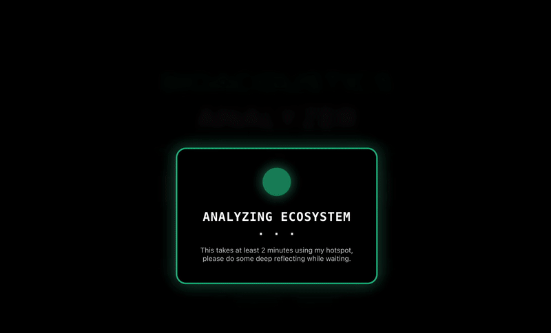
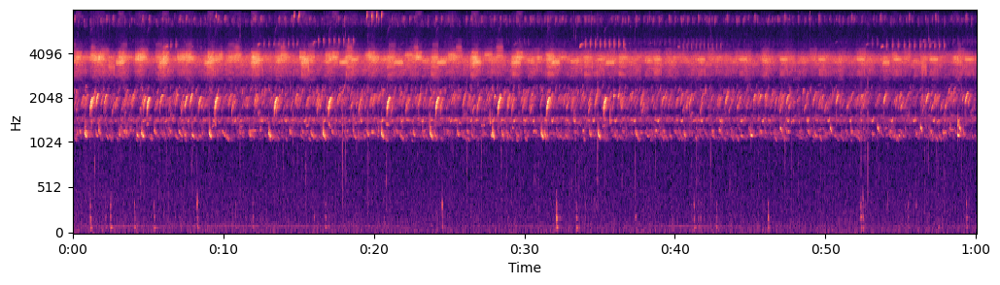
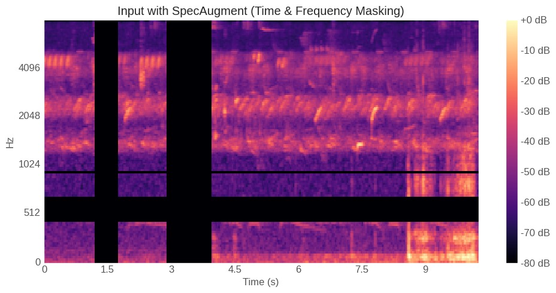
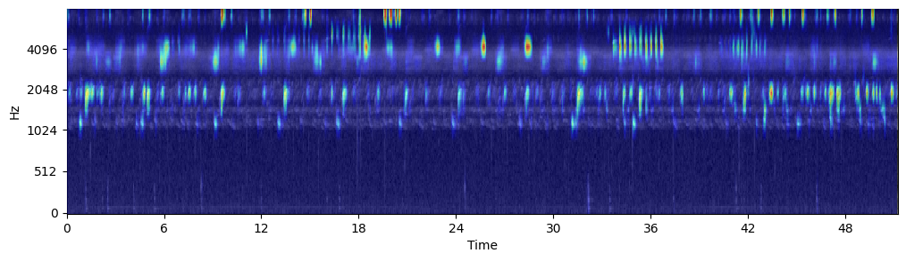
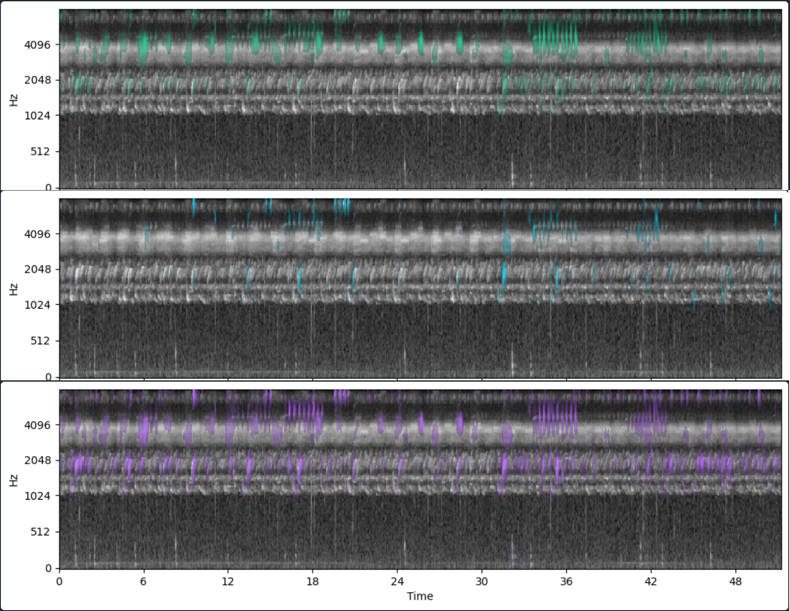

# Bioacoustics: Assessing Ecosystem Biodiversity using Transformers


## [**Live Website: https://bioacoustics.vercel.app**](https://bioacoustics.vercel.app)



*(Real-time inference showing biodiversity scoring, spectrogram generation, plotly distribution, XAI attention rollout & mechanistic interpretability)*

- - - - - - - - - - - - - - - - - - - - - - - - - - - - - - - - - - - - - - - - - - -

### 🏆 1st Place - AI & Data Science Showcase 
***University of Houston | HPE-Data Science Institute - Fall 2025***

Our team developed an end-to-end ML pipeline for assessing the biodiversity of ecosystems using only the audio signal as input to a custom Audio Spectrogram Transformer (AST).

**Our Team:**
* **Dylan Berens** (Machine Learning Engineer)
* **Dominic McDonald** (Data Science Webmaster)
* **Shruthi Yenamagandla** (CNN Architect)

## 📐 Project Scope & Theory
Species use sounds to communicate, so they evolved to occupy different frequencies in the overall "soundscape". As a result, the acoustic signature of a biodiverse ecosystem is distributed (and varied) activity across many frequency bands.

To quantify this, our pipeline was engineered to answer three increasingly complex questions about acoustic input from ecosystems:
1. **What (Linear Regression):** What is the biodiversity score of this ecosystem? *(calculated via custom linear regression head)*
2. **Why (Explainable AI):** Why did our model predict that score? *(visualized via global Attention Rollout heatmap)*
3. **Which (Mechanistic Interpretability):** Which specific parts of our model's architecture influenced that prediction? *(unlabeled feature extraction via forward hooks and linear probing)*

---

## 🚰 Data Pipeline 
* **Input:** We projected the raw audio waveform (1D) onto a 2D surface as a Mel Audio Spectrogram, representing frequency as the y-axis, time as the x-axis, and amplitude as the coloring of the image.

* **Target Variable:** We created our custom "Robust Acoustic Diversity Index (R-ADI)", a calculation derived from the Shannon Entropy across 35 frequency bands.
  * **Background Subtraction:** removes constant noise (like rain or rivers) by subtracting the median energy across the spectrogram
  * **Adaptive Thresholding:** only count sounds >13.5dB above baseline
  * **Frequency Banding:** splits the spectrogram into 35 vertically stacked 200Hz frequency bands
  * **Shannon Entropy:** measures the evenness of activity across the 35 bands to reward diverse ecosystems with different frequencies
  * **Soft Fallback:** assigns a fractional score based on energy sum if nothing >13.5 dB, to discourage flat 0 scores
* **Dataset:** [Kaggle RFCx Species Audio Detection](https://www.kaggle.com/competitions/rfcx-species-audio-detection/data)
* **Model:** A pre-trained Hugging Face Audio Spectrogram Transformer (AST) with a 3 layer custom regression head.
  * Sequential Transfer Learning: ViT-base (ImageNet) -> AST  (AudioSet) -> Our Custom Model (Rainforest Bioacoustics)
  * Scale: ~86.6M parameters, 101 layers
* **Libraries:** PyTorch | TensorFlow | HuggingFace | Librosa | NumPy | Pandas | Plotly | Torchaudio | FFmpeg | Matplotlib | OpenCV

---

## ⚙️ Methods & Training
* **Results:** Achieved **R² = 0.95** after 75 epochs, with our baseline CNN scoring 0.70 with the same setup.
* **Differential Learning Rates:**
  * 1e-5 for the backbone to allow for gradual fine tuning of the extensively trained AST backbone
  * 1e-4 for the custom regression head to more rapidly converge
* **Temporal Augmentation (Training):** During training our model sees a random 10.24s slice from the 60s file each epoch. This turns what was a limiting constraint based on model architecture (built to digest 10.24s at a time) into a form of data augmentation that promotes generalization: over 75 epochs, the model sees slices distributed across the full 60s file, preventing memorization of any single time window.
* **Loss Function:** Mean Absolute Error (MAE): to not discourage the model for making bold predictions
* **SpecAugment:** We applied Frequency Masking (horizontal black bars masking Hz ranges) and Temporal Masking (vertical black bars masking time ranges), as a second form of data augmentation, to promote generalizability by further encouraging the model to not rely on particular regions too heavily.


## 🔬 Explainable AI (XAI)
Rather than just outputting what our model predicted, we employed Attention Rollout Heatmaps to explain *why* our model predicted the way it did, and Mechanistic Interpretability to detail *which parts of our model* explained why it predicted the way it did.

### Attention Rollout Heatmap (Global)
We implemented Attention Rollout Heatmaps for model interpretability, to be able to explain *why* our model was predicting the way it did. This visualization marks regions of the Spectrogram it sits on top of, indicating regions of the audio file that most heavily influenced the model's prediction. (Red/Yellow = high influence on model's prediction)



*(It's worth noting early versions of this project resulted in attention heatmaps with broad regions colored; the sparse, targeted marks on our current attention rollout heatmaps are indicative of a confident model that knows where to look to assess biodiversity, which aligns with the 0.95 R² of our final AST model.)*

### Mechanistic Interpretability (Linear Probe Based Unsupervised Labeling)

To overcome the limitation of an incompletely labeled dataset, we inspected the model's latent space to determine if it learned to disentangle complex audio features (biophony vs. anthrophony vs. geophony) naturally through the process of training to predict regression scores. The initial training was framed as a regression task (predicting R-ADI score), forcing the model to learn a highly structured physical representation of the soundscape. 

* **Activation Caching (Forward Hooks):** We attached PyTorch forward hooks to the frozen AST backbone, extracting and caching the multi-head attention weights across all 12 transformer encoder layers during inference.
* **Latent Space Auditing:** We processed an entirely unseen environmental audio dataset (ESC-50) through the frozen model, allowing us to see how the model's internal circuitry responds to known, labeled acoustic features (e.g., chainsaw, drops of water, bird calls).
* **Linear Probing:** We trained 15 single-layer logistic regression probes on the cached activations to identify which specific layers and attention heads learned to differentiate these discrete acoustic concepts.
* **Identifying Polysemanticity:** This audit revealed "feature entanglement"— instances where the model superimposed unrelated concepts into the exact same neural circuit. Most notably, Layer 7 / Head 9 was the strongest predictor of both the 'Insects' class (f1: 0.904) and the 'Engine' class (f1: 0.9111). This superposition proves the model did not learn a clear decision boundary between complex biophony and mechanical anthrophony, directly informing our dataset expansion strategy.



*(Attention Rollout heatmaps from Amazon Rainforest audio: green = frogs, blue = chirping birds, purple = crickets)*

---

## 🚀 Deployment
* **Sliding Window Inference (Production):** Since the AST expects an input of 10.24s, our approach stitches together 5 non-overlapping windows when performing inference to cover the first 51.2 seconds of the soundscape.
  * *Aggregation Logic:* Our method predicts the ADI score for all 5 slices of spectrogram, **selects the top 3 scores, and averages** them. This was a domain specific choice because an ecosystem is as biodiverse as its most active moments (a panther roar that may only happen once in a 60 second theater of bird sounds and insect drones reflects the true biodiversity "capability" of that ecosystem). We average the top 3 to lower the influence of transient sounds that occur in the upper frequencies but are not biophony (animal sounds).
* **Containerization (Docker):** Our inference backend is fully containerized, handling complex dependencies and allowing reproducibility across coding environments.
* **Google Cloud Run:** We deployed our containerized backend on Google Cloud to allow our website to run 24/7 (and autoscale based on traffic) without manually running our original Colab notebook.
* **Frontend (Vercel):** Our website and frontend is hosted on Vercel and is a React/TypeScript dashboard for real-time inference and visualization that is live and runs 24/7.
* **Model Optimization (PTQ & Cold Starts):** Achieved a 73.9% reduction in model size (347MB -> 91MB) using INT8 Post-Training Quantization, trading a minimal decrease in predictive accuracy (R² 0.95 -> 0.93) for a massive improvement in inference efficiency. We then decoupled our Hugging Face model's architecture initialization from the default weights, bypassing a 340MB network download during container cold-starts. Together these changes allowed us to reduce our deployment memory tier (4Gi -> 3Gi), shave 3-5 seconds off our cold-start latency, decrease GCP bucket storage costs, and crucially will enable our future improvement of real-time edge deployment on a Raspberry Pi.
* **Confidence Interval Framing (Monte Carlo Dropout):** Leveraged Monte Carlo Dropout to reframe the model's prediction from a singular score to a 95% Confidence Interval. By running five consecutive stochastic forward passes on the same input with reactivated dropout layers, we created a bounded range biodiversity score that more strongly and transparently communicates the true state of the analyzed ecosystem. We achieved this 5x compute multiplier without triggering timeout limits by explicitly bounding PyTorch's threading to our Cloud Run vCPU allocation—preventing CPU thrashing and capitalizing on our INT8 quantization efficiency.

---

## Acknowledgements

**Dr. Nouhad Rizk** for her mentoring and leadership! Not only did you teach my two favorite classes by far in all of undergrad (Data Science I & Data Science II), but your active involvement in getting students engaged on campus (creating numerous clubs, encouraging classroom participation, hosting university-wide data science events) is huge. 

**Drew Purves**' appearance on Google DeepMind: The Podcast with Hannah Fry heavily inspired the topic of our team's project. "The Nature of AI: solving the planet's data gap" (https://www.youtube.com/watch?v=vIIIau06wGo)

## Future Improvements
 * **Resolving Feature Entanglement (Anthrophony Dataset):** To solve the superposition of insect and mechanical sounds discovered during our mechanistic interpretability audit, we will be expanding our training data to include a targeted subset (~20%) of mechanical audio files. This will encourage our model to treat these features as orthogonal while maintaining its primary objective of scoring biodiversity.
 * **Generalizability (Savannah Dataset):** We will further expand the training data (~30%)  to include topographically and biologically distinct biomes (e.g., the African Savanna or the Arctic) to calibrate the baseline ADI calculations and combat overfitting by correcting the target variable skew that resulted from training primarily on highly biodiverse Amazon rainforest data.
 * **Model Distillation:** While we successfully compressed our core model by reducing its weight precision from float32 to INT8, a longer term improvement is Model Distillation-- training a second, much smaller model to approximate the prediction of our current model and the actual ADI score. This would reduce model size and storage costs even further, but requires architecting and training another model.
 * **Real Time Edge Deployment:** Deploying Raspberry Pis with a containerized, distilled model backend across remote ecosystems in Costa Rica, Sundaland and the Arctic.

## Anti-disclaimer
All the backend code and text content of our project was typed, not auto-generated, including the thousands of lines of scrapped code that were removed by the final version of our research notebook.

## Run Locally
```bash
git clone https://github.com/dylanberens/Bioacoustics.git
cd backend
docker build -t bioacoustics .
docker run -p 5000:5000 bioacoustics
